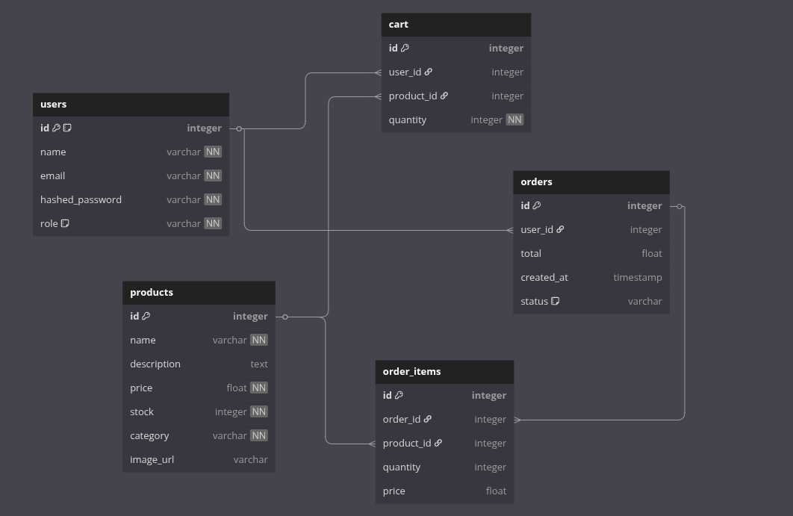

# FastAPI || E-Commerce API

This is a simple E-Commerce backend built with **FastAPI**, supporting:

- JWT-based user authentication
- Cart management (add, update, remove)
- Dummy checkout
- Order history and details
- Structured responses and Error logging

---

## Project Structure

```
app/
├── auth/              # User registration, login
├── cart/              # Cart routes and logic
├── core/              # Database and main settings
├── models/            # SQLAlchemy models
├── orders/            # Order listing and detail routes
├── utils/             # Common utilities (e.g., responses)
└── main.py            # App entrypoint
logs/
└── logs.txt           # Runtime error and request logs
```

---

## Entity Relationship Diagram (ERD)



---

## Getting Started

### 1. Clone the repository

```bash
git clone https://github.com/Gajmain2020/NT-Python-Cap.git
cd PythonCap
```

### 2. Create a virtual environment

```bash
python3 -m venv .venv
source .venv/bin/activate
```

### 3. Install dependencies

```bash
pip install -r requirements.txt
```


### 4. Create .env file
Create .env file and add the following variables:
```bash
# FOR DATABASE CONFIG
DATABASE_URL

# FOR JWT RELATED CONFIG
JWT_SECRET_KEY
ALGORITHM
ACCESS_TOKEN_EXPIRE_MINUTES
REFRESH_TOKEN_EXPIRE_DAYS

# FOR PASSWORD RESET CAN USE BREVO STMTP SERVICES
EMAIL_HOST
EMAIL_PORT
EMAIL_USERNAME
EMAIL_PASSWORD
EMAIL_FROM
```

### 5. Run the application

```bash
uvicorn app.main:app --reload
```

The API will be available at: [http://localhost:8000](http://localhost:8000)

The API Docs will be availabel at: [http://localhost:8000/docs](http://localhost:8000/docs)

### 6. Postman Collection Link

The Postman API Collection is available at: [Postman Collection](https://gold-desert-234944.postman.co/workspace/CollegeERP~8e611849-971a-4971-a09c-044da526077b/collection/29780692-3b1d639e-35ef-42bc-8ba2-2189ab0529c3?action=share&creator=29780692)

---

## Author

Made by [Gajendra Sahu](https://gajju2309.vercel.app). Contributions welcome!

---